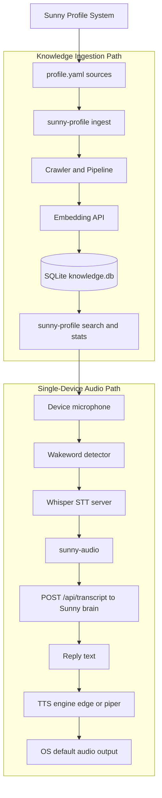

# Sunny Profile

[](https://go.dev/)

[](https://github.com/sameersemna/sunny-profile/actions/workflows/ci.yml)
[](LICENSE)


Sunny Profile is a local-first Go project that does two things:

- Builds a personal knowledge base from your profile URLs (website, blog, GitHub, LinkedIn, startup pages).
- Runs an always-on voice client that listens for Hey Sunny and responds on the same device.

The project is designed to pair with an external Sunny brain service and Whisper server.

## Quickstart (60 seconds)

```bash
# 1) Build
make build

# 2) Configure your profile sources
# Edit profile.yaml with your URLs

# 3) Ingest knowledge
./bin/sunny-profile ingest --profile profile.yaml

# 4) Run single-device voice client
./bin/sunny-audio --tts edge --brain http://127.0.0.1:8765 --whisper-host promaxgb10-6116
```

Say "Hey Sunny" and then speak your query.

## Demo

Expected end-to-end interaction:

```text
Sunny is online. Say hey sunny to activate me.
Wake word detected: "hey sunny"
Heard: "what should I focus on this week"
Sunny: "Focus on customer discovery calls and shipping one measurable onboarding improvement."
```

To record an animated terminal demo:

```bash
# install once
sudo apt install -y asciinema

# record
asciinema rec docs/sunny-audio-demo.cast

# then run a short session in another terminal
./bin/sunny-audio --tts edge --brain http://127.0.0.1:8765 --whisper-host promaxgb10-6116
```

Tip: convert the cast to GIF/MP4 with your preferred tool and embed it in this section.

## Architecture



## Repository Layout

```text
cmd/
	sunny-profile/   # ingestion + search + stats CLI
	sunny-audio/     # single-device wake word client (recommended)
	sunny-sonos/     # legacy Sonos output path
internal/
	ingestion/       # crawling and chunking pipeline
	rag/             # SQLite vector store + embedding calls
	wakeword/        # microphone capture + wake phrase detection
	tts/             # edge-tts and piper integration
	audio/           # local audio playback abstraction
docs/
	SONOS.md         # now documents single-device audio setup
scripts/
	find-sonos.sh
	pi_listener.py
```

## Prerequisites

- Go 1.22+
- Linux audio tools for capture and playback
- Access to:
	- Sunny brain API (default: http://127.0.0.1:8765)
	- Whisper server (default host: promaxgb10-6116, port 8768)
	- Embedding endpoint (default: http://promaxgb10-6116:9107)

Recommended packages on Ubuntu or Debian:

```bash
sudo apt update
sudo apt install -y ffmpeg mpv mpg123 vlc pulseaudio-utils alsa-utils curl
```

## Build

```bash
make build
```

This produces:

- ./bin/sunny-profile
- ./bin/sunny-audio
- ./bin/sunny-sonos

## Configure Profile Sources

Edit profile.yaml and replace placeholder URLs with your own sources.

Key settings:

- embed_url: embedding API base URL
- embed_model: embedding model name
- db_path: SQLite database path
- profile.sources: list of URLs, labels, and max_depth

## Knowledge Base Workflow

Ingest all configured sources:

```bash
./bin/sunny-profile ingest --profile profile.yaml
```

Search the knowledge base:

```bash
./bin/sunny-profile search "startup experience machine learning"
```

Show per-label chunk stats:

```bash
./bin/sunny-profile stats
```

Makefile shortcuts:

```bash
make ingest
make search
make stats
```

## Single-Device Audio Client (Recommended)

This mode uses one machine for both input and output:

- Input: current default microphone
- Output: whatever output device your OS currently routes audio to

### Install TTS

Edge TTS (internet required):

```bash
pip3 install edge-tts --break-system-packages
```

Or Piper (offline): install piper binary and a .onnx voice model.

### Run

Edge mode:

```bash
./bin/sunny-audio --tts edge --brain http://127.0.0.1:8765 --whisper-host promaxgb10-6116
```

Piper mode:

```bash
./bin/sunny-audio --tts piper --piper-model ./en_US-lessac-medium.onnx --brain http://127.0.0.1:8765 --whisper-host promaxgb10-6116
```

Useful flags:

- --wake: custom wake phrase (default hey sunny)
- --query-seconds: capture duration after wake (default 8)
- --session: session id sent to brain
- --mode: mode sent to brain (default general)

Makefile shortcut:

```bash
make run-audio
```

## Brain API Contract

The audio client sends transcripts to:

```http
POST /api/transcript
Content-Type: application/json
```

Request body shape expected by the client:

```json
{
	"session_id": "desktop-audio",
	"speaker": "me",
	"text": "what should I focus on this week",
	"mode": "general"
}
```

Response handling rules used by the client:

- HTTP status >= 300 is treated as an error.
- For successful JSON responses, the spoken reply is the first string found in this key order:
	- reply
	- response
	- assistant
	- text
	- message
- If no key contains text, the client falls back to speaking "Got it.".

Example successful response:

```json
{
	"reply": "Focus on customer discovery calls and shipping one measurable onboarding improvement."
}
```

## Legacy Sonos Mode

The repository still includes sunny-sonos for Sonos speaker output, but single-device sunny-audio is now the preferred path.

See docs/SONOS.md for details.

## Troubleshooting

- If wake word never triggers:
	- verify your microphone input works with arecord or parec
	- confirm Whisper server is reachable
- If no spoken output:
	- ensure at least one player exists (ffplay, mpv, mpg123, cvlc, paplay, aplay)
	- test edge-tts or piper directly
- If ingest fails:
	- verify embed_url is reachable
	- check that profile URLs are publicly crawlable

## Development Notes

- The project uses CGO with sqlite3, so build tooling must support CGO.
- Storage is local SQLite by default.
- Commands are implemented with Cobra.
